# Enterprise Credential Access Attack Detection & Response (Microsoft Defender XDR)


---

## Overview
This project simulates a real-world **credential access attack** involving a malicious payload (**Mimikatz**) and demonstrates how a SOC analyst detects, investigates, and responds using Microsoft Defender XDR to achieve rapid containment and prevent further compromise.

The attack lifecycle:
- Initial access via user download attempt  
- Endpoint-level detection by Microsoft Defender  
- Incident correlation in Defender XDR  
- Threat validation using VirusTotal  
- Containment and remediation actions  
- Prevention through IOC blocking  

---

## SOC Analyst Investigation Walkthrough

1. Alert triggered in Microsoft Defender indicating a blocked malware attempt  
2. Opened incident in Defender XDR to review alert details and affected endpoint  
3. Analyzed attack story to understand source, file, and device relationships  
4. Investigated file hash and validated it using VirusTotal  
5. Performed advanced hunting (KQL) to check for similar activity across endpoints  
6. Confirmed no lateral movement or additional compromise  
7. Reviewed investigation graph to validate attack path and containment  
8. Applied remediation actions and ensured IOC blocking was enforced

This workflow reflects a real-world SOC investigation process, combining alert triage, threat validation, and proactive hunting.

**Outcome:**  
Threat was successfully detected, investigated, and contained with no further impact to the environment.


---

## Architecture

```text
                                                Internet (Exploit Source)
                                                        ↓
                                                User Download Attempt
                                                        ↓
                                                Endpoint (Windows + Defender)
                                                        ↓
                                                Microsoft Defender XDR
                                                        ↓
                                  Detection → Investigation → Response → IOC Blocking
```

---

## Environment Setup
- Windows Server (Defender onboarded)  
- Microsoft Defender XDR  
- Exploit-DB (attack simulation)  
- VirusTotal (threat intelligence)  

<p align="center">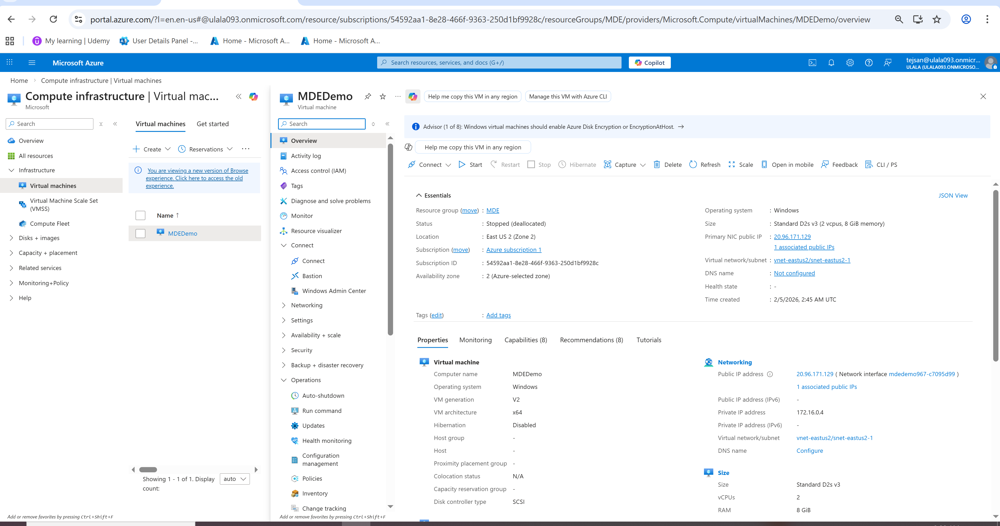</p>

**Explanation:**  
This shows the lab environment hosted on Azure, where the Windows endpoint is onboarded to Defender XDR for centralized monitoring and detection.

---

## Detection
Malicious file detected during download attempt.

<p align="center">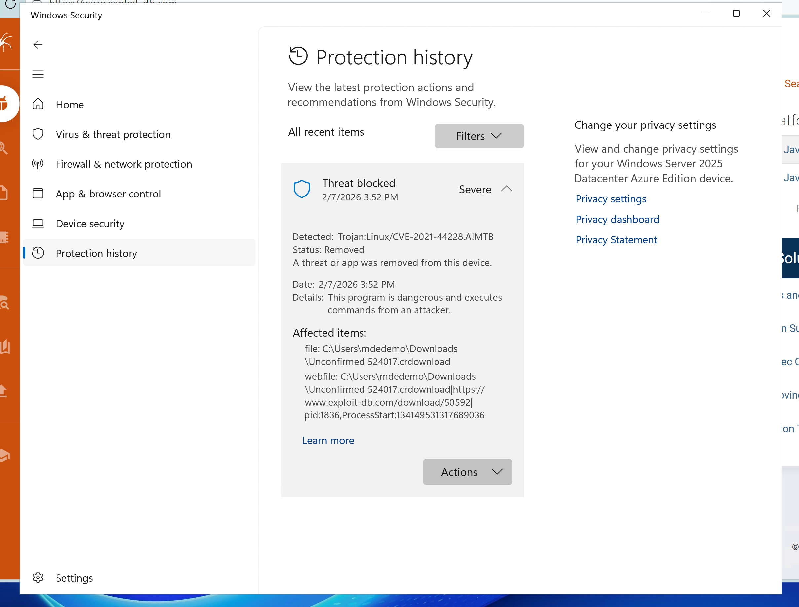</p>

**Explanation:**  
Microsoft Defender identified the file as malicious at the endpoint level and blocked execution in real time, preventing credential dumping activity.

---

## Detection Logic (Why Defender Triggered)

**Core Detection Signals:**
- Known malicious signature associated with **Mimikatz**
- Suspicious file behavior (credential dumping patterns)
- Memory access targeting LSASS (Local Security Authority Subsystem Service)
- High-risk classification based on Defender threat intelligence

**Behavioral Indicators:**
- Attempt to extract credentials from system memory  
- Use of tools commonly associated with post-exploitation  
- Execution pattern matching known attack techniques  

**Mapped MITRE Techniques:**
- **T1003** – Credential Dumping  
- **T1059** – Command Execution  

**SOC Insight:**  
Defender does not rely only on file hash detection — it combines **signature + behavior + threat intelligence**, which significantly improves detection accuracy.

---

## Alert & Incident

<p align="center">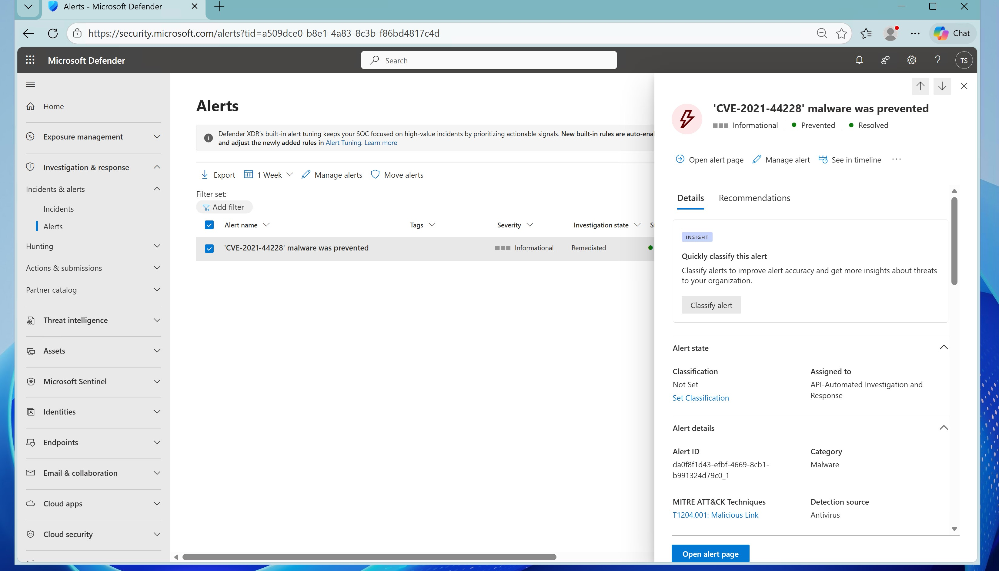</p>

**Explanation:**  
An alert was generated indicating malware prevention, confirming that the attack was stopped before execution.

<p align="center">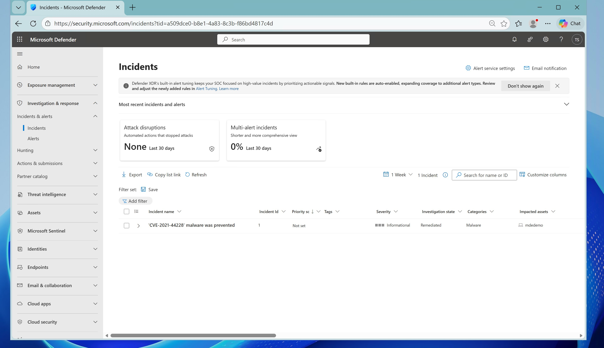</p>

**Explanation:**  
Defender XDR automatically grouped related alerts into a single incident, enabling efficient investigation.

<p align="center">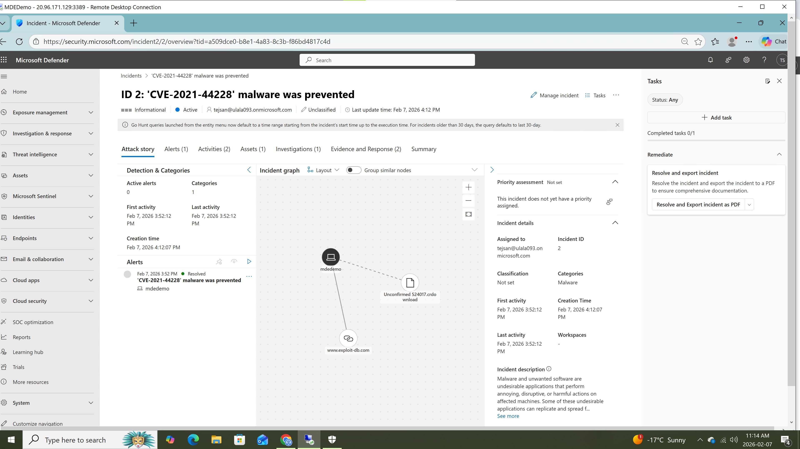</p>

**Explanation:**  
The attack story visualizes the full attack chain, showing how the malicious file originated and was blocked at the endpoint.

---

## Evidence Analysis

<p align="center">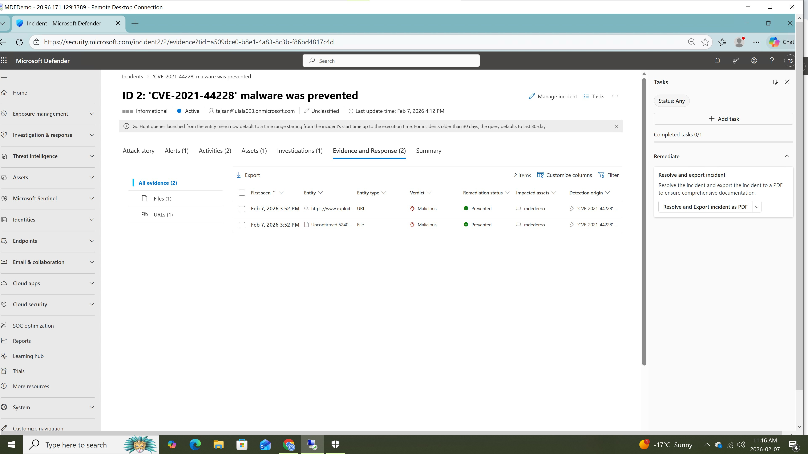</p>

**Explanation:**  
This section highlights forensic evidence such as file hashes, process activity, and impacted assets used during the investigation.

---

## File Investigation

<p align="center">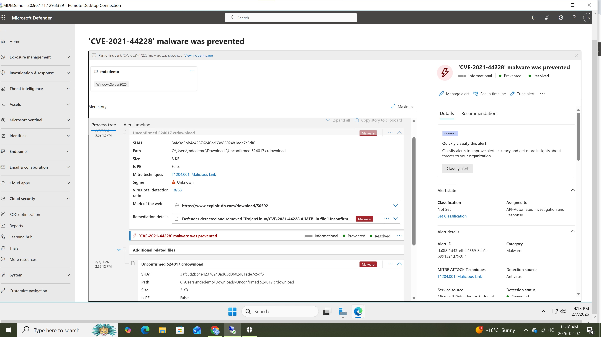</p>

**Explanation:**  
Detailed file analysis confirms the payload behavior, including detection signatures and associated risk level.

---

## Threat Intelligence

<p align="center">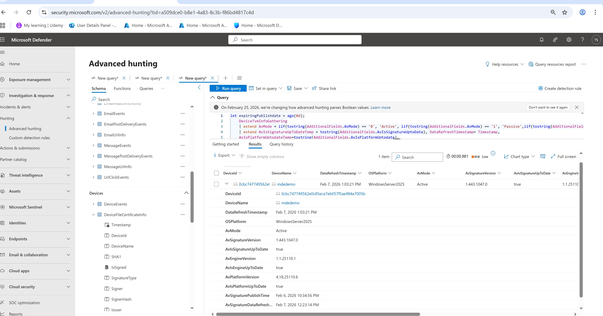</p>

**Explanation:**  
The file hash was validated against VirusTotal, confirming it as a known Mimikatz variant used for credential dumping.

---

## Threat Hunting (KQL)

```kql
DeviceFileEvents
| where FileName contains "mimikatz"
```

<p align="center">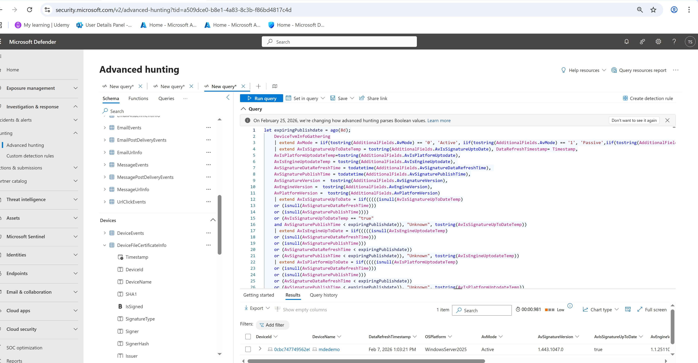</p>

**Explanation (SOC Analysis):**  
This query was executed in Microsoft Defender Advanced Hunting to proactively search for any instances of **Mimikatz-related artifacts** across endpoints.

**What this shows:**
- The query returned activity associated with the endpoint (`mdedemo`)  
- The device is running **Windows Server 2025**  
- Microsoft Defender is in **Active protection mode**  
- Signature and engine versions are **up-to-date**, ensuring reliable detection  

**Why this matters (SOC Thinking):**
- Confirms the attack did not silently execute elsewhere  
- Validates that **no additional endpoints were impacted**  
- Ensures Defender detection capabilities are fully operational  

**Analyst Conclusion:**
- No evidence of lateral movement or widespread compromise  
- Threat was **successfully contained to a single endpoint**  
- Environment is **secure after validation**

This step demonstrates proactive threat hunting beyond alert-based detection — a key responsibility of SOC Level-2 analysts.

---

## Investigation Graph

<p align="center"></p>

**Explanation:**  
The investigation graph visualizes relationships between key entities including the affected device (`mdedemo`), the malicious file, and the external source (`exploit-db`).

**What this shows:**
- The malicious file originated from an external domain  
- The file was downloaded onto the endpoint  
- The attack path is clearly mapped from source → file → device  

**SOC Value:**  
This provides a **correlated view of the attack chain**, allowing analysts to quickly understand origin, impact, and containment without manually analyzing logs.

**Analyst Insight:**  
The attack was successfully blocked at the endpoint, with no further propagation observed beyond the initial device.

---

## Response & Remediation

<p align="center">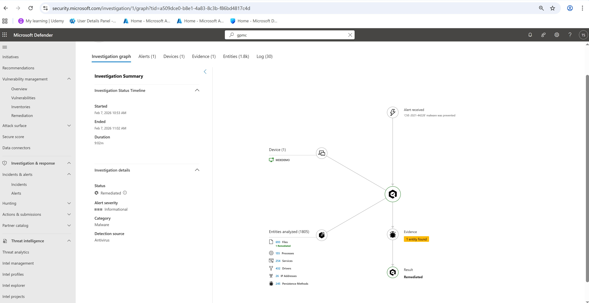</p>

**Explanation:**  
Automated and manual response actions were executed, including file quarantine and threat removal.

---

## IOC Blocking

<p align="center">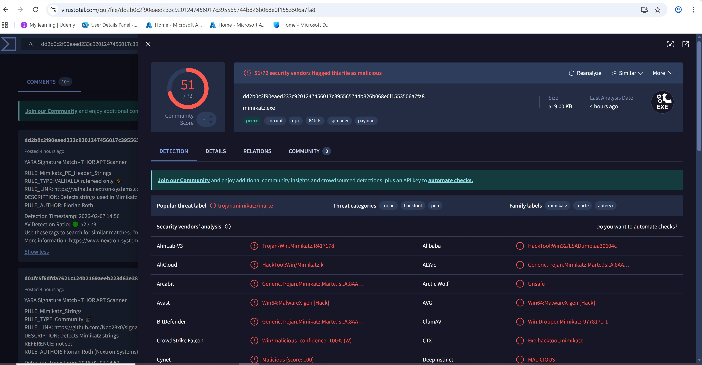</p>

**Explanation:**  
Indicators of Compromise (IOCs) such as file hashes were added to block future execution.

<p align="center">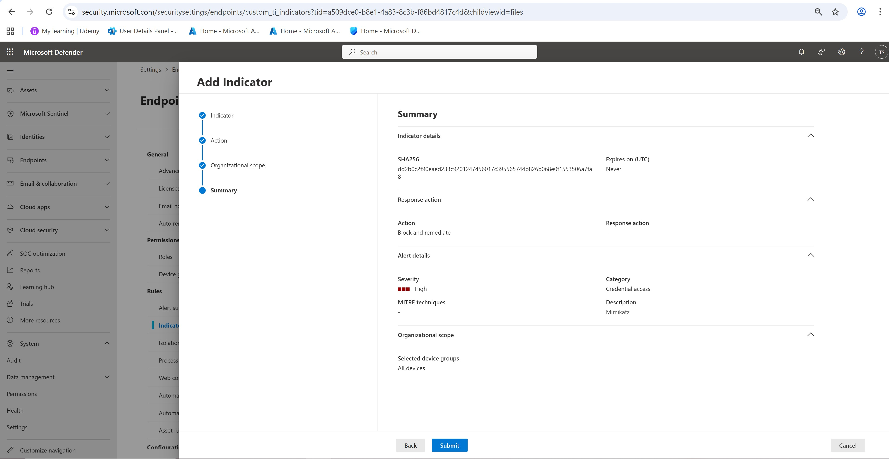</p>

**Explanation:**  
The IOC was successfully enforced across the environment to prevent reinfection.

---

## False Positives Consideration

**Potential False Positives:**
- Security researchers or red team activities using Mimikatz  
- Legitimate admin tools with similar behavior patterns  
- Testing environments where credential tools are expected  

**SOC Approach:**
- Validate file hash using threat intelligence (VirusTotal)  
- Correlate with user activity and process execution  
- Confirm whether activity aligns with expected behavior  

---

## Detection Improvements (SOC Level Thinking)

**Enhanced Hunting Queries:**
```kql
DeviceProcessEvents
| where ProcessCommandLine contains "mimikatz"
```

```kql
DeviceImageLoadEvents
| where InitiatingProcessFileName =~ "mimikatz.exe"
```

**Additional Improvements:**
- Monitor LSASS access attempts  
- Enable Attack Surface Reduction (ASR) rules  
- Integrate alerts with SIEM (Microsoft Sentinel)  
- Correlate with identity logs for credential misuse  

---

## Security Recommendations

<p align="center">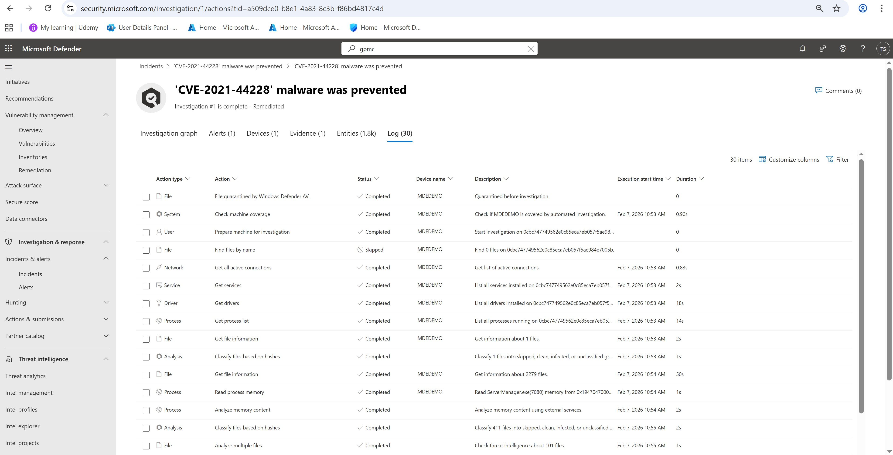</p>

**Explanation:**  
Defender provided actionable recommendations to improve security posture.

<p align="center">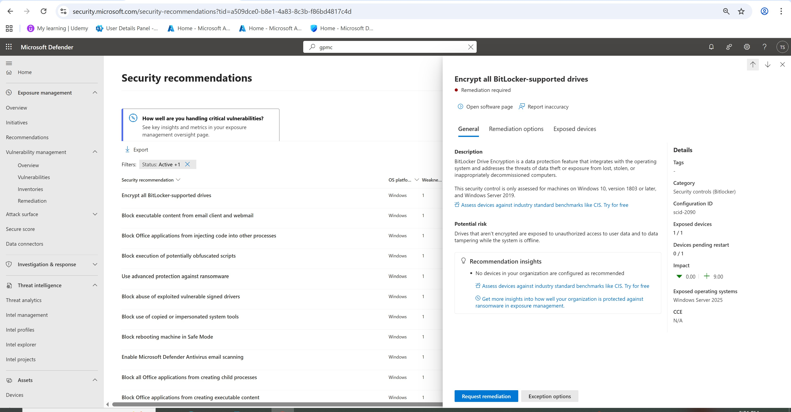</p>

**Explanation:**  
BitLocker encryption was recommended to enhance data protection against potential credential theft scenarios.

---

## MITRE ATT&CK Mapping

| Technique ID | Name |
|-------------|-----|
| T1204.001 | User Execution (Malicious Link) |
| T1003 | Credential Dumping (Mimikatz) |
| T1059 | Command Execution |
| T1190 | Exploit Public-Facing Application |

---

## Impact
- Devices affected: 1  
- Execution: Blocked  
- Persistence: None  
- Lateral Movement: None
- Detection Time: Near real-time  
- Response Time: Immediate containment via Defender automation  

---

## Skills Demonstrated
- Microsoft Defender XDR  
- Incident Response  
- Threat Hunting (KQL)  
- Threat Intelligence  
- MITRE ATT&CK Mapping  
- Endpoint Security  

---

## Author
**Tejinder Singh**
